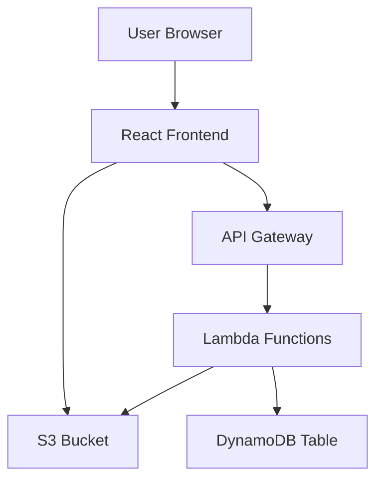
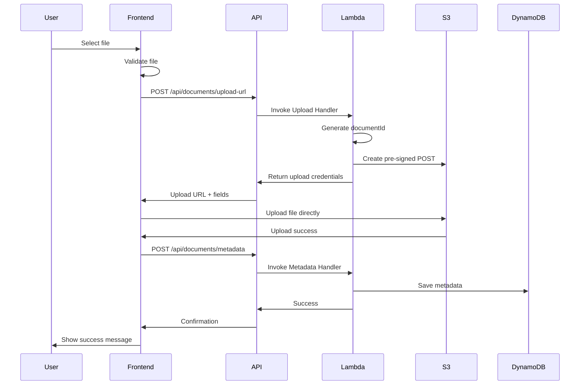
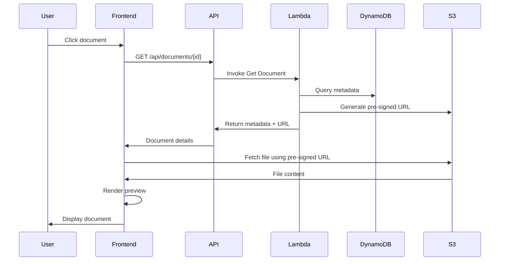

# Design Document: Architecture Review System

## Overview

The Architecture Review System is a web application that enables users to upload documents (PPT, PDF, Word) and images (PNG, JPG), preview them in the browser, and search through uploaded files. The system uses AWS S3 for file storage and DynamoDB for metadata persistence. The architecture follows a serverless approach using AWS Lambda for backend processing and a React-based frontend for the user interface.

## Architecture

### High-Level Architecture



### Component Overview

1. **Frontend (React)**: Single-page application providing upload, preview, and search interfaces
2. **API Gateway**: RESTful API endpoints for backend operations
3. **Lambda Functions**: Serverless compute for business logic
4. **S3**: Object storage for uploaded files
5. **DynamoDB**: NoSQL database for document metadata

### Technology Stack

- **Frontend**: React, TypeScript, AWS Amplify (for S3 uploads)
- **Backend**: AWS Lambda (Node.js/TypeScript), API Gateway
- **Storage**: AWS S3, DynamoDB
- **Infrastructure**: AWS CDK for infrastructure as code

## Components and Interfaces

### Frontend Components

#### 1. Upload Component
- **Purpose**: Handle file selection and upload
- **Features**:
  - Drag-and-drop area
  - File selection button
  - Progress indicator
  - File validation (type, size)
- **Interface**:
  ```typescript
  interface UploadComponentProps {
    onUploadSuccess: (documentId: string) => void;
    onUploadError: (error: Error) => void;
  }
  ```

#### 2. Document List Component
- **Purpose**: Display paginated list of uploaded documents
- **Features**:
  - Sortable columns
  - Pagination controls
  - File type icons
  - Click to preview
- **Interface**:
  ```typescript
  interface DocumentListProps {
    documents: DocumentMetadata[];
    onDocumentSelect: (documentId: string) => void;
    currentPage: number;
    totalPages: number;
    onPageChange: (page: number) => void;
  }
  ```

#### 3. Search Component
- **Purpose**: Filter documents by filename
- **Features**:
  - Search input field
  - Real-time filtering
  - Clear search button
- **Interface**:
  ```typescript
  interface SearchComponentProps {
    onSearch: (query: string) => void;
    currentQuery: string;
  }
  ```

#### 4. Preview Component
- **Purpose**: Render document preview
- **Features**:
  - Image viewer for PNG/JPG
  - PDF viewer using react-pdf
  - Office document viewer using Office Online or conversion
  - Download fallback
- **Interface**:
  ```typescript
  interface PreviewComponentProps {
    documentId: string;
    metadata: DocumentMetadata;
    presignedUrl: string;
  }
  ```

### Backend Components

#### 1. Upload Handler Lambda
- **Purpose**: Process file upload requests
- **Responsibilities**:
  - Validate file type and size
  - Generate unique document ID
  - Create S3 pre-signed POST URL
  - Return upload credentials to frontend
- **API Endpoint**: `POST /api/documents/upload-url`
- **Request**:
  ```typescript
  interface UploadUrlRequest {
    filename: string;
    fileType: string;
    fileSize: number;
  }
  ```
- **Response**:
  ```typescript
  interface UploadUrlResponse {
    documentId: string;
    uploadUrl: string;
    fields: Record<string, string>;
  }
  ```

#### 2. Metadata Handler Lambda
- **Purpose**: Save document metadata after successful upload
- **Responsibilities**:
  - Receive upload confirmation
  - Save metadata to DynamoDB
  - Handle retry logic
- **API Endpoint**: `POST /api/documents/metadata`
- **Request**:
  ```typescript
  interface SaveMetadataRequest {
    documentId: string;
    filename: string;
    fileType: string;
    fileSize: number;
    s3Key: string;
  }
  ```

#### 3. List Documents Lambda
- **Purpose**: Retrieve paginated document list
- **Responsibilities**:
  - Query DynamoDB
  - Apply pagination
  - Sort by upload date
- **API Endpoint**: `GET /api/documents?page={page}&limit={limit}`
- **Response**:
  ```typescript
  interface ListDocumentsResponse {
    documents: DocumentMetadata[];
    totalCount: number;
    currentPage: number;
    totalPages: number;
  }
  ```

#### 4. Search Documents Lambda
- **Purpose**: Search documents by filename
- **Responsibilities**:
  - Scan DynamoDB with filter
  - Return matching documents
- **API Endpoint**: `GET /api/documents/search?query={query}`
- **Response**:
  ```typescript
  interface SearchDocumentsResponse {
    documents: DocumentMetadata[];
    totalCount: number;
  }
  ```

#### 5. Get Document Lambda
- **Purpose**: Retrieve document metadata and generate pre-signed URL
- **Responsibilities**:
  - Fetch metadata from DynamoDB
  - Generate S3 pre-signed URL (1 hour expiration)
  - Return document details
- **API Endpoint**: `GET /api/documents/{documentId}`
- **Response**:
  ```typescript
  interface GetDocumentResponse {
    metadata: DocumentMetadata;
    presignedUrl: string;
  }
  ```

## Data Models

### DocumentMetadata (DynamoDB)

```typescript
interface DocumentMetadata {
  documentId: string;        // Primary Key (UUID)
  filename: string;          // Original filename
  fileType: string;          // MIME type (e.g., "application/pdf")
  fileSize: number;          // Size in bytes
  s3Key: string;             // S3 object key
  uploadTimestamp: number;   // Unix timestamp
  uploadDate: string;        // ISO 8601 date string (for display)
}
```

**DynamoDB Table Schema:**
- **Table Name**: `architecture-review-documents`
- **Primary Key**: `documentId` (String)
- **Global Secondary Index**: `uploadTimestamp-index` for sorting by date

### S3 Object Structure

**Bucket Name**: `architecture-review-files`

**Object Key Format**: `{timestamp}-{uuid}-{filename}`

Example: `1704412800000-a1b2c3d4-e5f6-7890-abcd-ef1234567890-presentation.pptx`

## Upload Flow



## Preview Flow




## Correctness Properties

*A property is a characteristic or behavior that should hold true across all valid executions of a system—essentially, a formal statement about what the system should do. Properties serve as the bridge between human-readable specifications and machine-verifiable correctness guarantees.*

### Property 1: File Extension Validation

*For any* filename, the Upload_Handler should accept it if and only if its extension is one of .ppt, .pptx, .pdf, .doc, .docx, .png, or .jpg (case-insensitive)

**Validates: Requirements 1.1, 1.2**

### Property 2: File Size Validation

*For any* file with a given size, the Upload_Handler should accept it if and only if the size is less than or equal to 50MB (52,428,800 bytes)

**Validates: Requirements 1.3, 1.4**

### Property 3: Unique Document ID Generation

*For any* set of uploaded documents, all document IDs should be unique (no duplicates)

**Validates: Requirements 1.5, 2.1**

### Property 4: Complete Metadata Storage

*For any* successfully uploaded document, the stored metadata should contain all required fields: documentId, filename, uploadTimestamp, fileSize, fileType, and s3Key

**Validates: Requirements 1.6, 2.2**

### Property 5: Document ID as Primary Key

*For any* document stored in DynamoDB, querying by its documentId should return exactly that document's metadata

**Validates: Requirements 2.3**

### Property 6: Retry Logic with Exponential Backoff

*For any* DynamoDB write operation that fails, the Storage_Manager should retry up to 3 times before giving up

**Validates: Requirements 2.4**

### Property 7: File Type Specific Rendering

*For any* document with a specific file type (PNG, JPG, PDF, PPT, PPTX, DOC, DOCX), the Preview_Renderer should use the appropriate rendering method for that file type

**Validates: Requirements 3.2, 3.3, 3.4, 3.5**

### Property 8: Preview Metadata Display

*For any* document being previewed, the display should include both the filename and upload date

**Validates: Requirements 3.7**

### Property 9: Document List Field Completeness

*For any* document in the displayed list, all required fields (filename, upload date, file size, file type) should be present and visible

**Validates: Requirements 4.2, 5.3**

### Property 10: Pagination Logic

*For any* document list with more than 20 items, the system should display exactly 20 items per page (except the last page which may have fewer)

**Validates: Requirements 4.3**

### Property 11: Sort Order Consistency

*For any* document list, documents should be sorted by upload timestamp in descending order (newest first)

**Validates: Requirements 4.4**

### Property 12: Search Filtering Accuracy

*For any* search query and document set, the search results should include all and only those documents whose filename contains the search term (case-insensitive)

**Validates: Requirements 5.1, 5.2**

### Property 13: Search Result Restoration

*For any* document list, clearing the search query should restore the full list of documents

**Validates: Requirements 5.5**

### Property 14: S3 Key Uniqueness and Format

*For any* file stored in S3, the object key should follow the format "{timestamp}-{uuid}-{filename}" and be unique across all stored files

**Validates: Requirements 6.1**

### Property 15: Content-Type Header Correctness

*For any* file uploaded to S3, the content-type header should match the file extension (e.g., "application/pdf" for .pdf files)

**Validates: Requirements 6.2**

### Property 16: Pre-signed URL Expiration

*For any* generated pre-signed URL, the expiration time should be set to 1 hour (3600 seconds) from generation time

**Validates: Requirements 6.5**

### Property 17: Error Message Specificity

*For any* upload failure, the error message displayed should contain information about the specific failure reason (file type, file size, network, etc.)

**Validates: Requirements 7.1**

### Property 18: DynamoDB Error Handling

*For any* DynamoDB operation failure, the system should log the error details and display a user-friendly message to the user

**Validates: Requirements 7.4, 7.5**

### Property 19: Upload Progress Indication

*For any* file being uploaded, a progress indicator should be visible to the user during the upload process

**Validates: Requirements 8.3**

### Property 20: File Type Visual Indicators

*For any* document in the list, a visual indicator (icon) corresponding to its file type should be displayed

**Validates: Requirements 8.5**

## Error Handling

### Upload Errors

1. **Invalid File Type**: Return 400 error with message "File type not supported. Please upload PPT, PDF, Word, PNG, or JPG files."
2. **File Too Large**: Return 400 error with message "File size exceeds 50MB limit."
3. **S3 Upload Failure**: Return 500 error with message "Failed to upload file. Please try again."
4. **DynamoDB Write Failure**: After 3 retries, delete S3 object and return 500 error with message "Failed to save document metadata."

### Retrieval Errors

1. **Document Not Found**: Return 404 error with message "Document not found."
2. **S3 Access Error**: Return 500 error with message "Unable to access document. Please try again later."
3. **DynamoDB Query Error**: Return 500 error with message "Unable to retrieve documents. Please try again later."

### Preview Errors

1. **Unsupported Preview**: Display message "Preview not available for this file type. Click to download."
2. **Preview Load Failure**: Display message "Failed to load preview. Click to download the file."

### Error Logging

All errors should be logged with:
- Timestamp
- Error type
- Error message
- Stack trace (for unexpected errors)
- Request context (user ID, document ID, etc.)

## Testing Strategy

### Dual Testing Approach

The system will use both unit testing and property-based testing to ensure comprehensive coverage:

- **Unit Tests**: Verify specific examples, edge cases, and error conditions
- **Property Tests**: Verify universal properties across all inputs

Both testing approaches are complementary and necessary. Unit tests catch concrete bugs in specific scenarios, while property tests verify general correctness across a wide range of inputs.

### Property-Based Testing Configuration

- **Library**: fast-check (for TypeScript/JavaScript)
- **Minimum Iterations**: 100 runs per property test
- **Test Tagging**: Each property test must include a comment referencing the design property

Tag format:
```typescript
// Feature: architecture-review-system, Property 1: File Extension Validation
```

### Unit Testing Focus

Unit tests should focus on:
1. Specific examples demonstrating correct behavior
2. Integration points between components (Frontend ↔ API, Lambda ↔ S3/DynamoDB)
3. Edge cases (empty lists, single item, boundary values)
4. Error conditions (network failures, service unavailability)

### Property Testing Focus

Property tests should focus on:
1. Input validation (file types, sizes, formats)
2. Data integrity (metadata completeness, ID uniqueness)
3. Business logic (pagination, sorting, filtering)
4. Consistency (search results, preview rendering)

### Test Organization

```
tests/
├── unit/
│   ├── upload.test.ts
│   ├── metadata.test.ts
│   ├── list.test.ts
│   ├── search.test.ts
│   └── preview.test.ts
└── properties/
    ├── validation.property.test.ts
    ├── storage.property.test.ts
    ├── retrieval.property.test.ts
    └── ui.property.test.ts
```

### Integration Testing

Integration tests should verify:
1. End-to-end upload flow (Frontend → API → Lambda → S3 → DynamoDB)
2. End-to-end preview flow (Frontend → API → Lambda → DynamoDB → S3)
3. Search and pagination workflows
4. Error handling across component boundaries

### Performance Testing

Performance tests should verify:
1. Upload performance for files up to 50MB
2. List retrieval performance for large datasets (1000+ documents)
3. Search performance with various query patterns
4. Preview loading time for different file types
