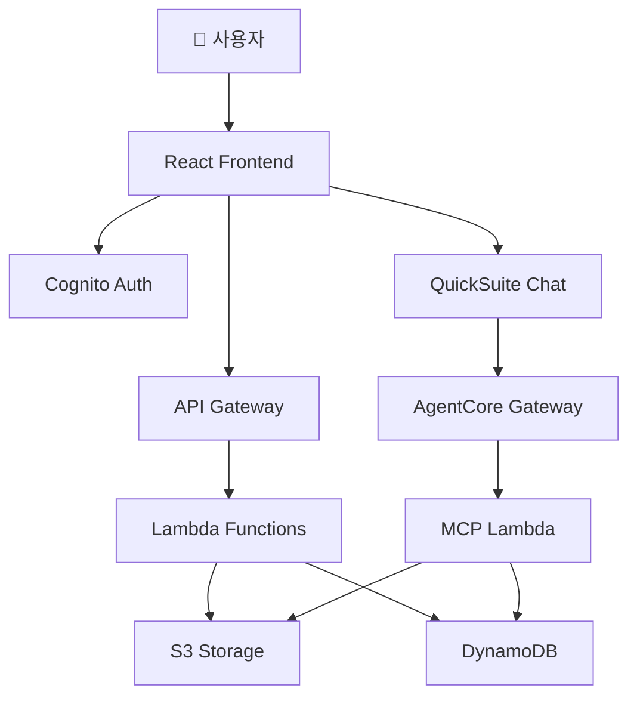

# Architecture Review System

> Amazon QuickSuite Chat Agent를 이용한 아키텍처 검토 시스템 - QuickSuite Chat Agent와 Bedrock AgentCore Gateway를 활용한 자동화된 아키텍처 문서 검토

[](https://opensource.org/licenses/MIT)
[](https://aws.amazon.com/)
[](https://www.typescriptlang.org/)
[](https://reactjs.org/)
[](https://nodejs.org/)

## 📖 소개

이 Architecture Review System은 Amazon Quick Suite의 Space, MCP Action, Knowledge base를 이용한 Agentic AI 기반 아키텍처 검토 시스템입니다. Quick Suite Chat Agent와 Space, Bedrock AgentCore Gateway, Lambda Target(MCP)을 통합하여 아키텍처 문서의 자동화된 검토 프로세스를 제공합니다.

### ✨ 주요 기능

- 📄 **문서 관리**: PDF, 이미지 파일 업로드/프리뷰 및 관리 (최대 50MB)
- 🤖 **Agentic AI 기반 아키텍처 검토**: Quick Suite Chat Agent를 통한 대화형 아키텍처 검토
- � **Quick Suite Chat Agent Embedding**: 채팅 에이전트를 기업의 애플리케이션에 임베딩하여 일관된 UI/UX 제공
- 🔗 **MCP 통합**: Model Context Protocol을 통한 확장 가능한 도구 연동(아키텍처 검토 요청 문서 저장/조회/프리뷰, 아키텍처 검토 상태 변경/검토 결과 저장 등)
- 🔐 **보안 인증**: AWS Cognito 기반 사용자 인증 및 AgentCore Gateway 인증
- 📊 **검토 결과 관리**: 마크다운 형식의 검토 결과 저장 및 보기
- 🎨 **직관적인 UI**: Material-UI 기반의 반응형 웹 인터페이스(프론트엔드)

### 🎬 데모


## 🏗️ 아키텍처



자세한 아키텍처는 [ARCHITECTURE.md](docs/ARCHITECTURE.md)를 참고하세요.

## 🚀 빠른 시작

### 사전 요구사항

- Node.js 18 이상
- AWS CLI 2.x 이상
- AWS CDK 2.x 이상
- AWS 계정 (관리자 권한 권장)
- QuickSuite Enterprise Edition 구독

### 전체 설정 프로세스

이 시스템을 완전히 설정하고 아키텍처 문서 리뷰를 수행하려면 다음 단계를 순서대로 진행하세요:

#### 📖 1단계: 기본 설치 및 배포
1. **[설치 가이드](docs/INSTALLATION.md)** - 사전 요구사항 및 환경 설정
2. **[배포 가이드](docs/DEPLOYMENT.md)** - AWS 리소스 배포 (Lambda, API Gateway, DynamoDB, S3, Cognito)
3. **[빠른 시작 가이드](docs/QUICKSTART.md)** - 5분 안에 로컬 환경 실행

#### 🤖 2단계: QuickSuite 설정
4. **[QuickSuite 설정 가이드](docs/QUICKSIGHT_SETUP.md)** - Chat Agent, Space, Knowledge Base 생성
5. **[AgentCore MCP 설정 가이드](docs/AGENTCORE_MCP_SETUP.md)** - MCP 도구 연동

#### ✅ 3단계: 아키텍처 문서 리뷰 수행
6. 프론트엔드에서 아키텍처 문서 업로드
7. QuickSuite Chat Agent를 통해 문서 검토
8. 검토 결과 확인 및 저장

### 간단 설치 (로컬 개발만)

QuickSuite 설정 없이 기본 기능만 테스트하려면:

```bash
# 1. 리포지토리 클론
git clone https://github.com/ironpe/architecture-review-using-quicksuite-chatagent-embeding.git
cd architecture-review-using-quicksuite-chatagent-embeding

# 2. 초기 설정 (의존성 설치 및 환경 변수 복사)
./scripts/setup.sh

# 3. 환경 변수 수정
# packages/frontend/.env
# packages/backend/.env
# packages/mcp-server/.env

# 4. AWS 리소스 배포
./scripts/deploy.sh

# 5. 프론트엔드 실행
./scripts/local-dev.sh
```

브라우저에서 http://localhost:5173 접속

> **참고**: 위 단계만으로는 문서 업로드 및 관리 기능만 사용 가능합니다. AI 기반 아키텍처 검토 기능을 사용하려면 위의 **전체 설정 프로세스**를 완료해야 합니다.

## 📚 문서

### 시작하기
- [설치 가이드](docs/INSTALLATION.md) - 상세한 설치 방법
- [배포 가이드](docs/DEPLOYMENT.md) - AWS 리소스 배포
- [빠른 시작](docs/QUICKSTART.md) - 5분 안에 시작하기

### 설정 가이드
- [Cognito 통합](docs/COGNITO_INTEGRATION.md) - 인증 설정
- [Quick Suite 설정](docs/QUICKSIGHT_SETUP.md) - Chat Agent 설정
- [AgentCore Gateway+MCP 통합 설정](docs/AGENTCORE_MCP_SETUP.md) - MCP 도구 연동

### 참고 자료
- [아키텍처](docs/ARCHITECTURE.md) - 시스템 아키텍처
- [프로젝트 요약](docs/PROJECT_SUMMARY.md) - 전체 프로젝트 개요
- [문제 해결](docs/TROUBLESHOOTING.md) - 일반적인 문제 해결

## 🛠️ 기술 스택

### 프론트엔드
- **프레임워크**: React 18.3 + TypeScript
- **빌드 도구**: Vite 5.0
- **UI 라이브러리**: Material-UI 7.3
- **상태 관리**: React Context
- **인증**: AWS Amplify 6.0
- **QuickSight**: amazon-quicksight-embedding-sdk 2.11

### 백엔드
- **런타임**: Node.js 18.x
- **언어**: TypeScript
- **AWS SDK**: @aws-sdk v3
- **빌드**: esbuild
- **테스트**: Vitest

### 인프라
- **IaC**: AWS CDK 2.172
- **언어**: TypeScript

### AWS 서비스
- **컴퓨트**: Lambda
- **API**: API Gateway (REST)
- **스토리지**: S3
- **데이터베이스**: DynamoDB
- **인증**: Cognito
- **AI/BI**: Quick Suite Chat Agent, Bedrock AgentCore

## 📦 프로젝트 구조

```
.
├── packages/
│   ├── frontend/          # React 프론트엔드
│   ├── backend/           # Lambda 함수
│   ├── infrastructure/    # CDK 인프라 코드
│   ├── mcp-server/        # MCP 서버
│   └── diagram-generator/ # 다이어그램 생성 (Python)
├── docs/                  # 문서
├── scripts/               # 배포 및 유틸리티 스크립트
├── README.md
└── LICENSE
```

## 🎯 주요 기능 상세

### 1. 문서 관리
- PDF, PNG, JPG, JPEG 파일 업로드 (최대 50MB)
- S3 기반 안전한 파일 저장
- DynamoDB를 통한 메타데이터 관리
- 파일명 기반 검색 기능
- 브라우저 내 문서 미리보기

### 2. Agentic AI 기반 아키텍처 검토
- Quick Suite Chat Agent 통합
- 자연어 대화를 통한 아키텍처 검토
- MCP 프로토콜 기반 도구 연동 : 검토 대상/결과 파일 저장, 검토 대상 조회, 검토 결과 상태 저장
- 검토 결과 자동 저장 : DynamoDB

### 3. 검토 관리
- 검토자, 아키텍처 개요 등 메타데이터 관리
- 검토 상태 추적 (검토 필요/완료)
- 마크다운 형식의 검토 결과 저장
- 검토 결과 렌더링 및 표시

### 4. 보안
- AWS Cognito 기반 사용자 인증
- JWT 토큰 기반 API 인증
- S3 Pre-signed URL을 통한 안전한 파일 업로드
- IAM 역할 기반 권한 관리

## � 라이선스

이 프로젝트는 MIT 라이선스 하에 배포됩니다. 자세한 내용은 [LICENSE](LICENSE) 파일을 참고하세요.

## 🙏 감사의 말

이 프로젝트는 다음 AWS 서비스와 오픈소스 프로젝트를 활용합니다:

- [AWS Lambda](https://aws.amazon.com/lambda/)
- [Amazon Quick Suite](https://aws.amazon.com/quicksuite/)
- [Amazon Bedrock AgentCore](https://aws.amazon.com/bedrock/)
- [AWS CDK](https://aws.amazon.com/cdk/)
- [React](https://reactjs.org/)
- [Material-UI](https://mui.com/)
- [Model Context Protocol](https://modelcontextprotocol.io/)

## 🔗 관련 링크

- [Amazon Quick Suite Embedded Chat Agent](https://aws.amazon.com/blogs/business-intelligence/announcing-embedded-chat-in-amazon-quick-suite/)
- [Quick Suite with MCP](https://aws.amazon.com/ko/blogs/machine-learning/connect-amazon-quick-suite-to-enterprise-apps-and-agents-with-mcp)
- [QuickSight Embedding SDK](https://github.com/awslabs/amazon-quicksight-embedding-sdk)
- [Bedrock AgentCore](https://docs.aws.amazon.com/bedrock-agentcore/latest/devguide/gateway.html)
- [Model Context Protocol](https://modelcontextprotocol.io/)

---


⭐ 이 프로젝트가 도움이 되었다면 Star를 눌러주세요!
