# Architecture Review System

> AWS 기반 AI 아키텍처 검토 시스템 - QuickSight Chat Agent와 Bedrock AgentCore를 활용한 자동화된 문서 검토

[](https://opensource.org/licenses/MIT)
[](https://aws.amazon.com/)
[](https://www.typescriptlang.org/)
[](https://reactjs.org/)
[](https://nodejs.org/)

## 📖 소개

Architecture Review System은 AWS 서버리스 아키텍처를 기반으로 구축된 AI 기반 문서 검토 시스템입니다. QuickSight Chat Agent와 Bedrock AgentCore Gateway를 통합하여 아키텍처 문서의 자동화된 검토 프로세스를 제공합니다.

### ✨ 주요 기능

- 📄 **문서 관리**: PDF, 이미지 파일 업로드 및 관리 (최대 50MB)
- 🤖 **AI 기반 검토**: QuickSight Chat Agent를 통한 대화형 문서 검토
- 🔗 **MCP 통합**: Model Context Protocol을 통한 확장 가능한 도구 연동
- 🔐 **보안 인증**: AWS Cognito 기반 사용자 인증 및 세션 관리
- 📊 **검토 결과 관리**: 마크다운 형식의 검토 결과 저장 및 시각화
- 🎨 **직관적인 UI**: Material-UI 기반의 반응형 웹 인터페이스

### 🎬 데모


## 🏗️ 아키텍처

```mermaid
graph TB
    User[👤 사용자] --> Frontend[React Frontend]
    Frontend --> APIGateway[API Gateway]
    Frontend --> Cognito[Cognito Auth]
    Frontend --> QuickSight[QuickSight Chat]
    
    APIGateway --> Lambda[Lambda Functions]
    Lambda --> S3[S3 Storage]
    Lambda --> DynamoDB[DynamoDB]
    
    QuickSight --> AgentCore[AgentCore Gateway]
    AgentCore --> MCPLambda[MCP Lambda]
    MCPLambda --> S3
    MCPLambda --> DynamoDB
```



자세한 아키텍처는 [ARCHITECTURE.md](docs/ARCHITECTURE.md)를 참고하세요.

## 🚀 빠른 시작

### 사전 요구사항

- Node.js 18 이상
- AWS CLI 2.x 이상
- AWS CDK 2.x 이상
- AWS 계정 (관리자 권한 권장)

### 설치

```bash
# 1. 리포지토리 클론
git clone https://github.com/ironpe/architecture-review-using-quicksuite-chatagent-embeding.git
cd architecture-review-using-quicksuite-chatagent-embeding

# 2. 초기 설정 (의존성 설치 및 환경 변수 복사)
./scripts/setup.sh

# 3. 환경 변수 수정
# packages/frontend/.env
# packages/backend/.env
# packages/mcp-server/.env

# 4. AWS 리소스 배포
./scripts/deploy.sh

# 5. 프론트엔드 실행
./scripts/local-dev.sh
```

브라우저에서 http://localhost:5173 접속

### 5분 빠른 시작

더 자세한 가이드는 [빠른 시작 가이드](docs/QUICKSTART.md)를 참고하세요.

## 📚 문서

### 시작하기
- [설치 가이드](docs/INSTALLATION.md) - 상세한 설치 방법
- [배포 가이드](docs/DEPLOYMENT.md) - AWS 리소스 배포
- [빠른 시작](docs/QUICKSTART.md) - 5분 안에 시작하기

### 설정 가이드
- [Cognito 통합](docs/COGNITO_INTEGRATION.md) - 인증 설정
- [QuickSight 설정](docs/QUICKSIGHT_SETUP.md) - Chat Agent 설정
- [AgentCore MCP 설정](docs/AGENTCORE_MCP_SETUP.md) - MCP 도구 연동

### 참고 자료
- [아키텍처](docs/ARCHITECTURE.md) - 시스템 아키텍처
- [프로젝트 요약](docs/PROJECT_SUMMARY.md) - 전체 프로젝트 개요
- [문제 해결](docs/TROUBLESHOOTING.md) - 일반적인 문제 해결

## 🛠️ 기술 스택

### 프론트엔드
- **프레임워크**: React 18.3 + TypeScript
- **빌드 도구**: Vite 5.0
- **UI 라이브러리**: Material-UI 7.3
- **상태 관리**: React Context
- **인증**: AWS Amplify 6.0
- **QuickSight**: amazon-quicksight-embedding-sdk 2.11

### 백엔드
- **런타임**: Node.js 18.x
- **언어**: TypeScript
- **AWS SDK**: @aws-sdk v3
- **빌드**: esbuild
- **테스트**: Vitest

### 인프라
- **IaC**: AWS CDK 2.172
- **언어**: TypeScript

### AWS 서비스
- **컴퓨트**: Lambda
- **API**: API Gateway (REST)
- **스토리지**: S3
- **데이터베이스**: DynamoDB
- **인증**: Cognito
- **AI/BI**: QuickSight, Bedrock AgentCore

## 📦 프로젝트 구조

```
.
├── packages/
│   ├── frontend/          # React 프론트엔드
│   ├── backend/           # Lambda 함수
│   ├── infrastructure/    # CDK 인프라 코드
│   ├── mcp-server/        # MCP 서버
│   └── diagram-generator/ # 다이어그램 생성 (Python)
├── docs/                  # 문서
├── scripts/               # 배포 및 유틸리티 스크립트
├── README.md
├── LICENSE
└── CONTRIBUTING.md
```

## 🎯 주요 기능 상세

### 1. 문서 관리
- PDF, PNG, JPG, JPEG 파일 업로드 (최대 50MB)
- S3 기반 안전한 파일 저장
- DynamoDB를 통한 메타데이터 관리
- 파일명 기반 검색 기능
- 브라우저 내 문서 미리보기

### 2. AI 기반 검토
- QuickSight Chat Agent 통합
- 자연어 대화를 통한 문서 검토
- MCP 프로토콜 기반 도구 연동
- 검토 결과 자동 저장

### 3. 검토 관리
- 검토자, 아키텍처 개요 등 메타데이터 관리
- 검토 상태 추적 (검토 필요/완료)
- 마크다운 형식의 검토 결과 저장
- 검토 결과 렌더링 및 표시

### 4. 보안
- AWS Cognito 기반 사용자 인증
- JWT 토큰 기반 API 인증
- S3 Pre-signed URL을 통한 안전한 파일 업로드
- IAM 역할 기반 권한 관리

## 🤝 기여하기

기여를 환영합니다! 자세한 내용은 [CONTRIBUTING.md](CONTRIBUTING.md)를 참고하세요.

### 기여 방법

1. 이 리포지토리를 Fork 합니다
2. Feature 브랜치를 생성합니다 (`git checkout -b feature/AmazingFeature`)
3. 변경 사항을 커밋합니다 (`git commit -m 'feat: Add some AmazingFeature'`)
4. 브랜치에 Push 합니다 (`git push origin feature/AmazingFeature`)
5. Pull Request를 생성합니다

## 🐛 버그 리포트 및 기능 제안

버그를 발견하거나 새로운 기능을 제안하고 싶으시다면 [GitHub Issues](https://github.com/ironpe/architecture-review-using-quicksuite-chatagent-embeding/issues)를 이용해주세요.

## � 라이선스

이 프로젝트는 MIT 라이선스 하에 배포됩니다. 자세한 내용은 [LICENSE](LICENSE) 파일을 참고하세요.

## 🙏 감사의 말

이 프로젝트는 다음 AWS 서비스와 오픈소스 프로젝트를 활용합니다:

- [AWS Lambda](https://aws.amazon.com/lambda/)
- [Amazon QuickSight](https://aws.amazon.com/quicksight/)
- [Amazon Bedrock AgentCore](https://aws.amazon.com/bedrock/)
- [AWS CDK](https://aws.amazon.com/cdk/)
- [React](https://reactjs.org/)
- [Material-UI](https://mui.com/)
- [Model Context Protocol](https://modelcontextprotocol.io/)

## 📞 문의

- **GitHub Issues**: [이슈 생성](https://github.com/ironpe/architecture-review-using-quicksuite-chatagent-embeding/issues)
- **GitHub Discussions**: [토론 참여](https://github.com/ironpe/architecture-review-using-quicksuite-chatagent-embeding/discussions)

## 🔗 관련 링크

- [AWS QuickSight Embedded Chat 블로그](https://aws.amazon.com/blogs/business-intelligence/announcing-embedded-chat-in-amazon-quick-suite/)
- [QuickSight Embedding SDK](https://github.com/awslabs/amazon-quicksight-embedding-sdk)
- [Bedrock AgentCore 문서](https://docs.aws.amazon.com/bedrock-agentcore/latest/devguide/gateway.html)
- [Model Context Protocol](https://modelcontextprotocol.io/)

---

**Made with ❤️ using AWS Serverless Technologies**

⭐ 이 프로젝트가 도움이 되었다면 Star를 눌러주세요!
