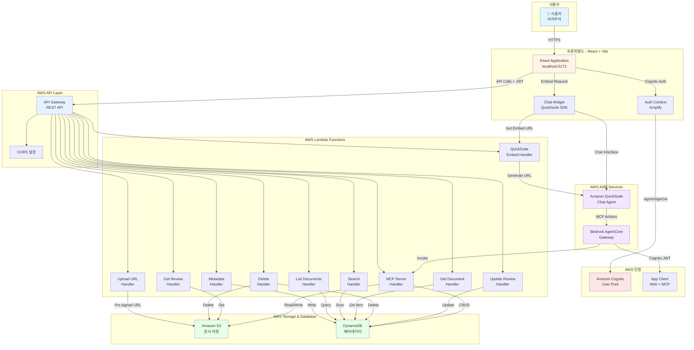
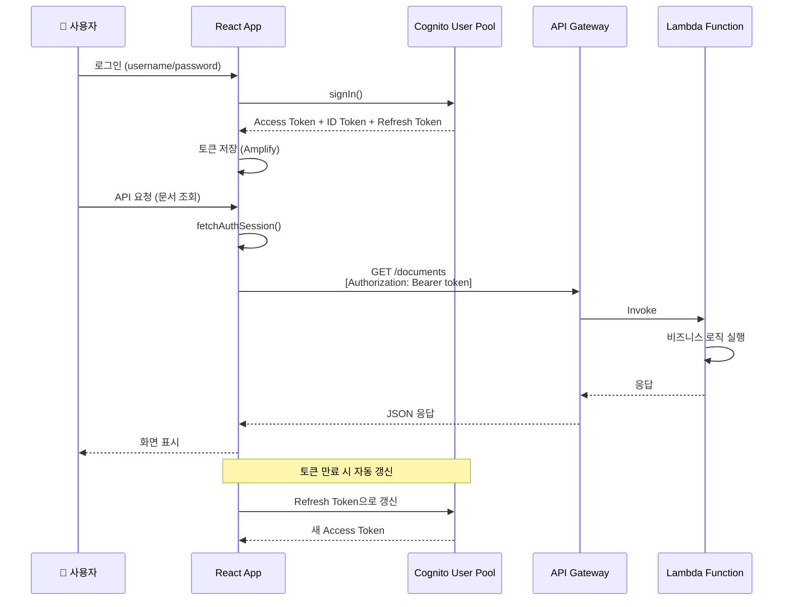
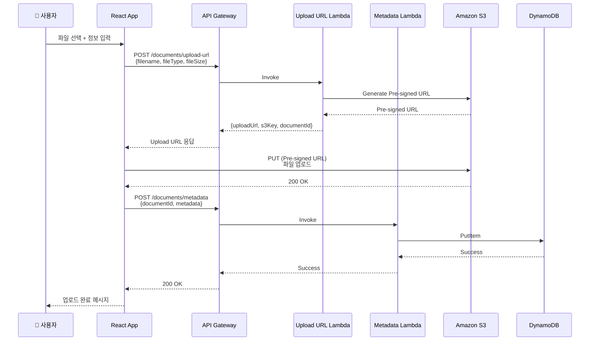
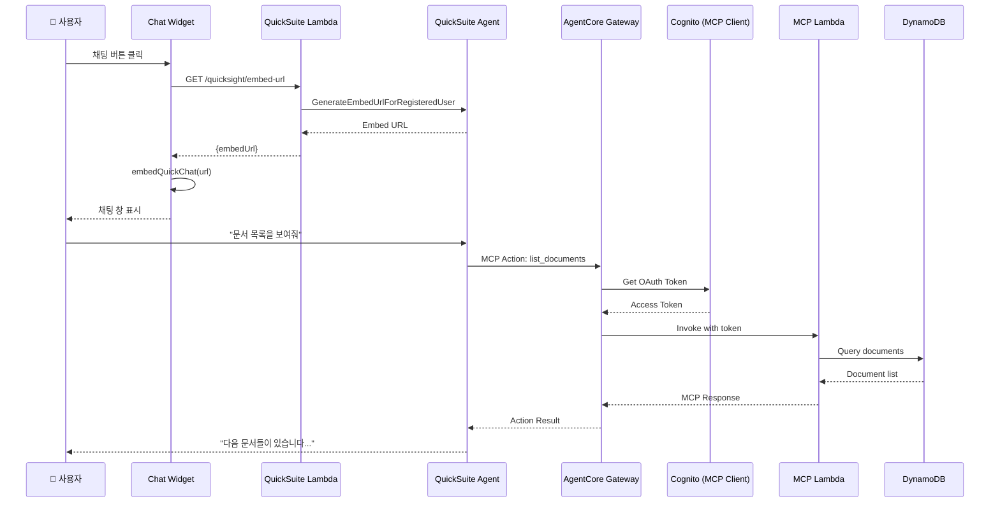
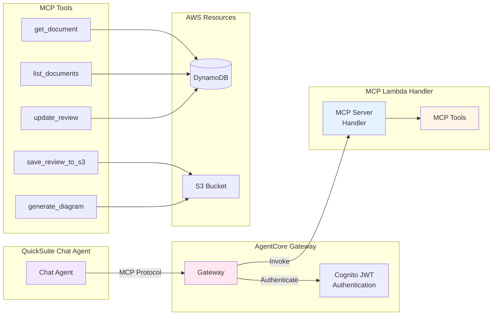
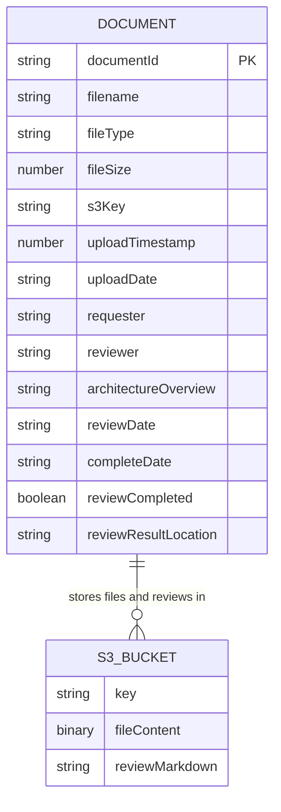
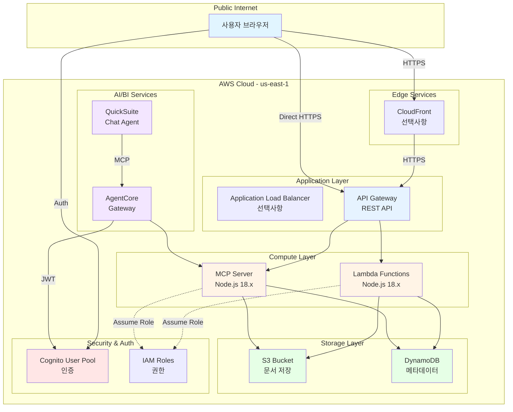
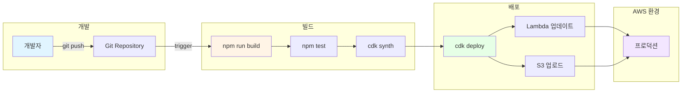
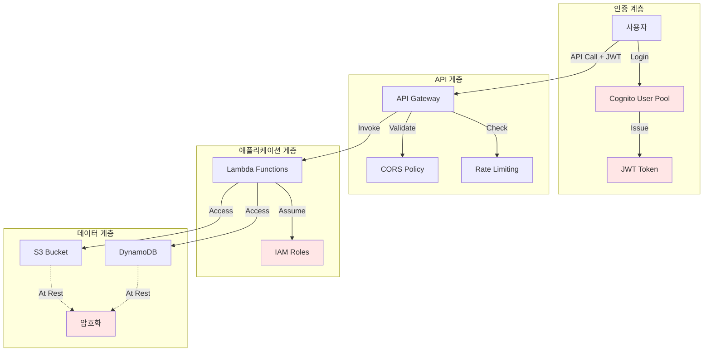

# Architecture Review System - 기술 아키텍처

## 📐 전체 시스템 아키텍처

## 🔐 인증 흐름

## 📄 문서 업로드 흐름

## 💬 QuickSuite Chat Agent 통합

## 🔧 MCP 도구 아키텍처

## 🗄️ 데이터 모델

**실제 구현:**
- **DynamoDB 테이블**: `architecture-review-documents` (문서 메타데이터 저장)
- **S3 버킷**: `architecture-review-files-*` (파일 및 검토 결과 저장)
  - 업로드된 파일: `documents/{documentId}/{filename}`
  - 검토 결과: `reviews/{documentId}/review.md`

## 🌐 네트워크 아키텍처

## 🔄 CI/CD 파이프라인 (권장)

## 📊 기술 스택 요약

### 프론트엔드
- **프레임워크**: React 18.2 + TypeScript
- **빌드 도구**: Vite 5.0
- **UI 라이브러리**: Material-UI 7.3
- **상태 관리**: React Context
- **인증**: AWS Amplify 6.0
- **HTTP 클라이언트**: Axios 1.6
- **마크다운**: react-markdown 10.1
- **QuickSuite**: amazon-quicksight-embedding-sdk 2.11

### 백엔드
- **런타임**: Node.js 18.x
- **언어**: TypeScript
- **AWS SDK**: @aws-sdk v3
- **빌드**: esbuild
- **테스트**: Vitest

### 인프라
- **IaC**: AWS CDK 2.172
- **언어**: TypeScript
- **배포**: CloudFormation

### AWS 서비스
- **컴퓨트**: Lambda
- **API**: API Gateway (REST)
- **스토리지**: S3
- **데이터베이스**: DynamoDB
- **인증**: Cognito
- **AI/BI**: QuickSuite, Bedrock AgentCore
- **모니터링**: CloudWatch (기본)

## 🔒 보안 아키텍처

---

**작성일**: 2026-01-06  
**버전**: 1.1.0  
**상태**: ✅ 완료
